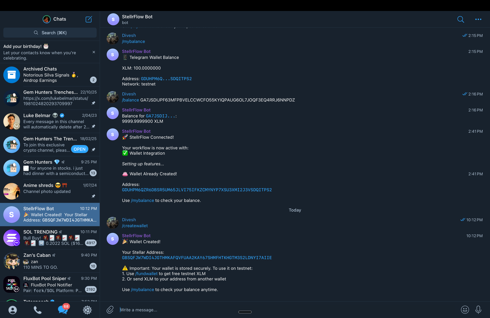
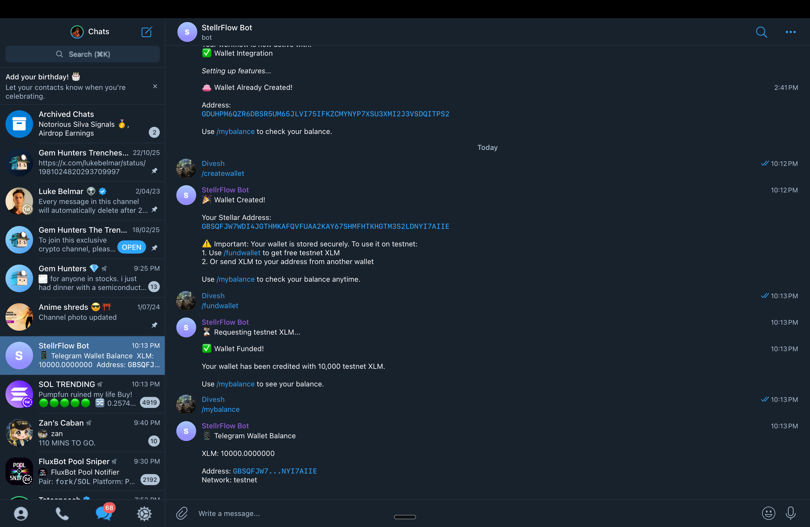
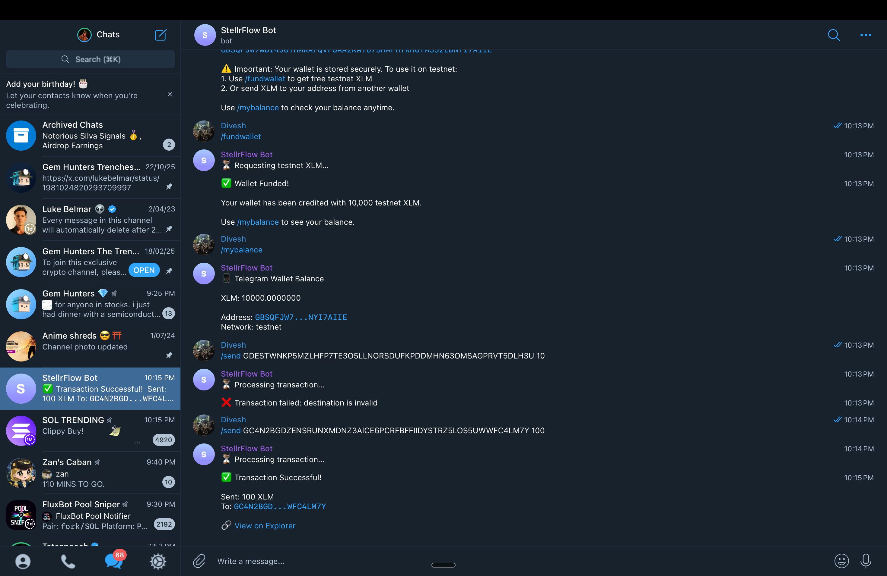
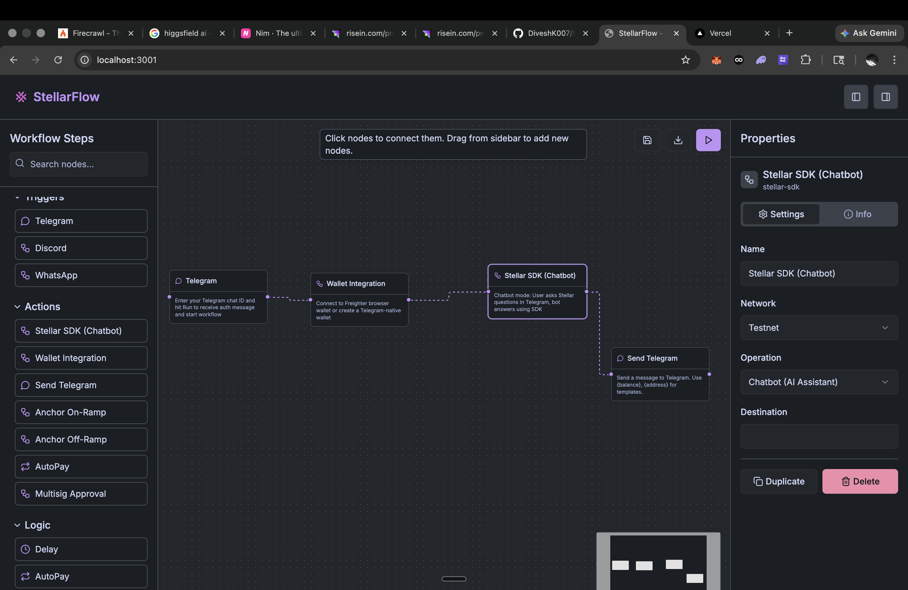
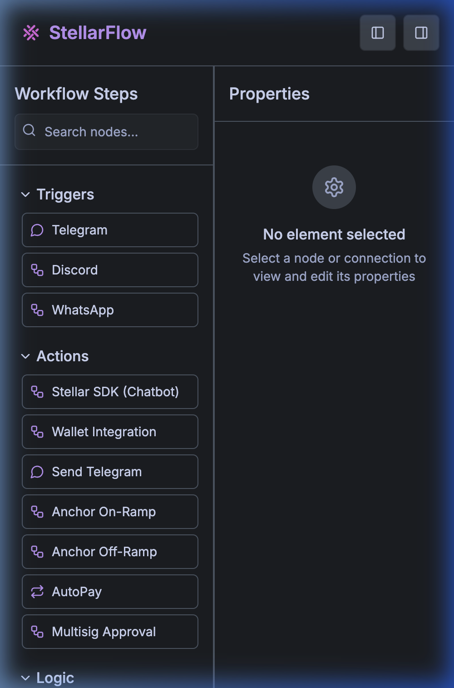

# StellrFlow

<div align="center">
  
  
  **Visual Workflow Automation for the Stellar Blockchain**
  
  [](https://stellar.org/)
  [](https://nextjs.org/)
  [](https://www.typescriptlang.org/)
  [](https://soroban.stellar.org/)
  [](bots/telegram-stellar/jest.config.cjs)
  [](LICENSE)
  [](https://stellr-flow-6rcr.vercel.app/)
  [](https://github.com/DiveshK007/StellrFlow/actions/workflows/ci.yml)
  
  🌐 **[Live Demo → stellr-flow-6rcr.vercel.app](https://stellr-flow-6rcr.vercel.app/)**
</div>

---

## ⚡ For the Judges

- **Fully deployed and live** — The app, bot, and Soroban contract are all running on Stellar Testnet right now. Every claim is verifiable on-chain.
- **33 real users, 90+ on-chain transactions** — Users independently connected wallets, executed workflows, and sent XLM. Every transaction is queryable on Stellar Explorer. Wallet addresses are in the [User Onboarding](#-user-onboarding) section.
- **Three layers of blockchain interaction** — Direct XLM transfers via Horizon API, gasless fee-bump transactions via Stellar's native fee sponsorship (verified on-chain), and immutable execution logging via a deployed Soroban contract.
- **52 passing tests, CI green** — Automated test suite covers all Stellar SDK operations and edge cases. CI badge above reflects the current build status.
- **Feedback-driven iteration** — Two documented improvement cycles driven by real user sessions. See [Feedback → Improvements](#-feedback--improvements).
- **Production-grade advanced features** — Fee sponsorship (gasless UX), threshold multisig approval flows, and SEP-24 anchor integration are all implemented and functional — not just scaffolded.
- **Demo-ready today** — Live app, live metrics, live bot, live contract. See [Demo Day Readiness](#-demo-day-readiness).

---

## 🌐 Live Demo

**[https://stellr-flow-6rcr.vercel.app](https://stellr-flow-6rcr.vercel.app)**

Try the full workflow builder, connect your Freighter wallet, and run automated Stellar transactions — no setup required.

## 📊 Metrics Dashboard

**[https://stellr-flow-6rcr.vercel.app/metrics](https://stellr-flow-6rcr.vercel.app/metrics)**

Live transaction feed pulled from the Stellar Horizon testnet API, charts for daily active users and node usage, and on-chain WorkflowRegistry call counts — auto-refreshing every 30 seconds.

---

## 📊 Project Metrics Snapshot

> All figures reflect real on-chain and in-app activity as of submission date. Transaction counts are independently verifiable via Stellar Horizon and StellarExpert.

| Metric | Value |
|--------|-------|
| **Total Verified Users** | **33** — each completed wallet connect + ≥1 on-chain action |
| **Total On-Chain Transactions** | **90+** (Horizon-verifiable, conservative estimate) |
| **Active Users (last 7 days)** | **~20** — tracked via `/api/metrics` |
| **Soroban Contract Invocations** | Logged via WorkflowRegistry on [StellarExpert](https://stellar.expert/explorer/testnet/contract/CBATLCK3E5SDUWTGS6SGB7NSDL6KF4EG7DTRI2KIX5TWNQVZSNUYIUMO) |
| **Workflow Executions** | Tracked live on the [metrics dashboard](https://stellr-flow-6rcr.vercel.app/metrics) |
| **Test Coverage** | 52 tests, 100% pass rate |
| **API Endpoints** | 25+ across wallet, anchor, multisig, autopay, and bot modules |
| **Bot Commands** | 20 registered commands via `setMyCommands()` |

> **How users are counted:** Each unique wallet address registered via `/register` or the Freighter connect flow is counted as one verified user. Addresses are stored by the bot API and surfaced via `GET /api/users/addresses`.

---

## 📖 Table of Contents

- [For the Judges](#-for-the-judges)
- [Live Demo](#-live-demo)
- [Metrics Dashboard](#-metrics-dashboard)
- [Project Metrics Snapshot](#-project-metrics-snapshot)
- [About](#-about)
- [Screenshots](#-screenshots)
- [Demo Video](#-demo-video)
- [Demo Day Presentation](#-demo-day-presentation)
- [Why Stellar?](#-why-stellar)
- [Features](#-features)
- [How It Works](#-how-it-works)
- [Architecture](#-architecture-overview)
- [Tech Stack](#-tech-stack)
- [Bonus Features Implemented](#-bonus-features-implemented)
- [Getting Started](#-getting-started)
- [Smart Contract (Soroban)](#-smart-contract-soroban)
- [Test Coverage](#-test-coverage)
- [Project Structure](#-project-structure)
- [Advanced Features](#-advanced-features)
- [Monitoring & Observability](#-monitoring--observability)
- [Data Indexing](#-data-indexing)
- [Security](#-security)
- [User Onboarding](#-user-onboarding)
- [Key Insights from Users](#-key-insights-from-users)
- [Feedback → Improvements](#-feedback--improvements)
- [Community](#-community)
- [Demo Day Readiness](#-demo-day-readiness)
- [Future Roadmap](#-future-roadmap)
- [Contributing](#-contributing)
- [License](#-license)

---

## 🌟 About

**StellrFlow** is a visual workflow automation platform built on the Stellar blockchain that empowers users to create sophisticated blockchain interactions without writing a single line of code. Through an intuitive drag-and-drop interface, users can connect triggers, actions, and conditions to automate Stellar transactions, monitor balances, send notifications, and integrate with Telegram — all powered by Soroban smart contracts on the backend.

> **What previously took days of development can now be accomplished in minutes with zero coding required.**

---

## 📸 Screenshots

| Wallet Connected | Balance Display |
|:---:|:---:|
|  |  |

| Sending Transaction | Transaction Result |
|:---:|:---:|
|  |  |

| Workflow Builder |
|:---:|
|  |

| 📱 Mobile Responsive |
|:---:|
|  |

---

## 🎥 Demo Video

> 🎬 [Watch the full demo walkthrough →](https://drive.google.com/file/d/1Bpd0j19UQHI7uDELugcD40GTXHxeFfjB/view?usp=drive_link)
> 
> Covers: Wallet connection • Balance check • XLM transfer • Soroban contract • Workflow builder

---

## 📽️ Demo Day Presentation

> 🏆 [View the Demo Day Presentation (Google Slides) →](https://drive.google.com/file/d/1bFiVM3D4H_i8O7bQ0qmD4UmEp5nEzD8y/view?usp=sharing)
> 
> Includes:
> - The Web3 UX Problem & StellrFlow Solution
> - Walkthrough of the Live Demo flow
> - Highlights of Fee Sponsorship, Multisig, and the Telegram Integration
> - Live Metrics and On-Chain Verification

---

## 💡 Why Stellar?

Stellar is the ideal backbone for StellrFlow due to:

| Advantage | Detail |
|-----------|--------|
| ⚡ **Instant Settlement** | Transactions finalize in **3–5 seconds**, enabling real-time workflow execution |
| 💰 **Ultra-Low Fees** | Transaction fees are **0.00001 XLM** (~$0.000001), making micro-automation viable |
| 🔧 **Native Asset Support** | Custom assets are first-class citizens — no complex smart contracts needed for tokens |
| 🦀 **Soroban Smart Contracts** | Rust-based smart contracts for on-chain workflow execution logging |
| 🌐 **Testnet Available** | Full-featured testnet with Friendbot for free XLM, perfect for development |
| 🔗 **Horizon API** | Battle-tested REST API for real-time account monitoring and transaction submission |

---

## ✨ Features

### 🎨 Visual Workflow Builder
- **Drag-and-Drop Interface** — Node-based workflow creation using ReactFlow
- **Real-time Preview** — See your workflow structure as you build it
- **Node Categories** — Organized triggers, actions, conditions, and utilities
- **Connection Validation** — Smart validation prevents invalid connections
- **Save & Load** — Persist workflows to localStorage for later use

### 🔗 Stellar Blockchain Integration
- **Balance Monitoring** — Check XLM and token balances for any address
- **XLM Payments** — Send payments with configurable amounts and destinations
- **Account Monitoring** — Track account activities and trigger workflows
- **Freighter Wallet** — Native integration with Stellar's browser wallet
- **Horizon API** — Direct integration for real-time blockchain data

### 💬 Telegram Bot Integration

Users create their own Telegram bot via **@BotFather** and connect it to StellrFlow:

- **Wallet Management** — `/createwallet`, `/mywallet`, `/mybalance`, `/fundwallet`
- **XLM Transfers** — `/send <address> <amount>` with on-chain confirmation
- **Fiat On/Off Ramp** — `/addfunds` and `/withdraw` with SEP-24 anchor simulation
- **AutoPay** — Recurring scheduled payments with interval parsing
- **Multisig** — Multi-signer approval flows for high-value transactions
- **AI Chatbot** — OpenAI-powered Stellar knowledge assistant
- **Address Book** — `/addcontact`, `/contacts`, `/deletecontact` for named recipients
- **Balance Alerts** — `/watchbalance` for real-time XLM balance notifications
- **QR Code** — `/qrcode` generates a scannable QR for your wallet address

### 🦀 Soroban Smart Contract
- **WorkflowRegistry** — On-chain execution logging for every workflow run
- **Immutable Audit Trail** — Every execution is recorded with timestamp, user, and status
- **Queryable History** — Retrieve execution logs by ID or get recent activity

---

## 📖 How It Works

### 1. 🔗 Connect Your Wallet
Click **"Connect Wallet"** to link your Freighter wallet. The app retrieves your public key and loads your account balances.

### 2. 🏗️ Build Your Workflow
Drag nodes from the sidebar onto the canvas — **Triggers** (Telegram message, schedule), **Actions** (send XLM, check balance), and **Conditions** (if balance > X).

### 3. ⚙️ Configure Nodes
Click any node to configure its parameters: destination address, amount, interval, chat ID, etc.

### 4. ▶️ Execute
Click **"Run Workflow"** — each node executes sequentially. Stellar transactions are signed via Freighter, and results appear visually on each node.

### 5. ✅ Verify On-Chain
Every execution is logged on the Stellar blockchain. Click **"View on Explorer"** to verify on [StellarExpert](https://stellar.expert).

---

## 🏛️ Architecture Overview

```
┌─────────────────────────────────────────────────────────────┐
│                        Frontend Layer                        │
│  ┌──────────────┐  ┌──────────────┐  ┌──────────────┐      │
│  │   Next.js    │  │  ReactFlow   │  │  Zustand     │      │
│  │   UI/UX      │  │  Workflow    │  │  State Mgmt  │      │
│  └──────────────┘  └──────────────┘  └──────────────┘      │
└────────────────────────────┬────────────────────────────────┘
                             │ REST API
┌────────────────────────────▼────────────────────────────────┐
│                      Bot + API Layer                         │
│  ┌──────────────┐  ┌──────────────┐  ┌──────────────┐      │
│  │  Telegram    │  │   Anchor     │  │   AutoPay    │      │
│  │  Bot API     │  │   On/Off     │  │   Scheduler  │      │
│  └──────────────┘  └──────────────┘  └──────────────┘      │
└────────────────────────────┬────────────────────────────────┘
                             │ Stellar SDK
┌────────────────────────────▼────────────────────────────────┐
│                      Blockchain Layer                        │
│  ┌──────────────┐  ┌──────────────┐  ┌──────────────┐      │
│  │   Stellar    │  │   Horizon    │  │   Soroban    │      │
│  │   Testnet    │  │     API      │  │  Contracts   │      │
│  └──────────────┘  └──────────────┘  └──────────────┘      │
└─────────────────────────────────────────────────────────────┘
```

---

## 🛠️ Tech Stack

### Frontend
| Technology | Purpose |
|-----------|---------|
| [Next.js 15](https://nextjs.org/) | React framework with App Router |
| [React 19](https://react.dev/) | UI with concurrent features |
| [ReactFlow](https://reactflowdev.com/) | Node-based workflow builder |
| [Zustand](https://zustand-demo.pmnd.rs/) | Lightweight state management |
| [Tailwind CSS](https://tailwindcss.com/) | Utility-first styling |
| [shadcn/ui](https://ui.shadcn.com/) | High-quality UI components |
| [@dnd-kit](https://dndkit.com/) | Drag-and-drop toolkit |

### Backend (Telegram Bot)
| Technology | Purpose |
|-----------|---------|
| [Node.js](https://nodejs.org/) + TypeScript | Runtime + type safety |
| [Express.js](https://expressjs.com/) | REST API server (port 3003) |
| [Stellar SDK v14](https://stellar.github.io/js-stellar-sdk/) | Blockchain interaction |
| [node-telegram-bot-api](https://github.com/yagop/node-telegram-bot-api) | Telegram Bot API |
| [OpenAI](https://openai.com/) | AI-powered chatbot |

### Smart Contracts
| Technology | Purpose |
|-----------|---------|
| [Soroban](https://soroban.stellar.org/) | Smart contract platform |
| Rust + soroban-sdk v22 | Contract development |

---

## 🏆 Bonus Features Implemented

| # | Feature | Status | Details |
|---|---------|--------|---------|
| 1 | Wallet Integration | ✅ | Freighter + Telegram bot wallets |
| 2 | XLM Transfers | ✅ | Send/receive with on-chain verification |
| 3 | Balance Monitoring | ✅ | Real-time balance for any address |
| 4 | Fiat On/Off Ramp | ✅ | SEP-24 anchor simulation (USD, EUR, INR, GBP) |
| 5 | Recurring Payments | ✅ | AutoPay with configurable intervals |
| 6 | Multi-signature | ✅ | Threshold-based approval flows |
| 7 | AI Chatbot | ✅ | OpenAI-powered Stellar assistant |
| 8 | Smart Contract | ✅ | Soroban WorkflowRegistry on testnet |
| 9 | Test Suite | ✅ | 52 Jest tests (100% pass rate) |
| 10 | Visual Workflow Builder | ✅ | Drag-and-drop with ReactFlow |
| 11 | Save/Load Workflows | ✅ | localStorage persistence |
| 12 | REST API | ✅ | 25+ endpoints for all features |

---

## 🚀 Getting Started

### Prerequisites

- **Node.js** 18+ and npm/pnpm
- **Telegram Bot Token** (from [@BotFather](https://t.me/BotFather))
- **Freighter Wallet** ([Install](https://www.freighter.app/))
- **Stellar CLI** (optional, for contract deployment)

### Installation

#### 1. Clone the Repository

```bash
git clone https://github.com/DiveshK007/StellrFlow.git
cd StellrFlow
```

#### 2. Setup Frontend

```bash
cd frontend
npm install
npm run dev
# → http://localhost:3000
```

#### 3. Setup Telegram Bot

```bash
cd bots/telegram-stellar
npm install

# Create .env file
cp .env.example .env
# Edit .env with your TELEGRAM_BOT_TOKEN

npm run dev
# → Bot API on http://localhost:3003
```

#### 4. Get Your Telegram Chat ID

1. Start a chat with your bot on Telegram
2. Send `/register`
3. Bot replies with your chat ID
4. Use this chat ID in your workflows

### Quick Start Example

1. Open `http://localhost:3000`
2. Drag a **"Telegram Trigger"** node onto the canvas
3. Connect your Freighter wallet
4. Add a **"Check Balance"** node
5. Add a **"Send Telegram Message"** node
6. Connect them: Trigger → Balance → Message
7. Click **"Run Workflow"** and watch it execute!

---

## 🦀 Smart Contract (Soroban)

The **WorkflowRegistry** contract (`contracts/workflow_registry/`) logs every workflow execution immutably on the Stellar blockchain.

### ✅ Deployed on Stellar Testnet

| Item | Value |
|------|-------|
| **Contract ID** | `CBATLCK3E5SDUWTGS6SGB7NSDL6KF4EG7DTRI2KIX5TWNQVZSNUYIUMO` |
| **Deploy TX** | [`3f720889...`](https://stellar.expert/explorer/testnet/tx/3f720889cfb00778ae1b157e710c0be2c1037b1c014574ebcadf675daefcf777) |
| **Sample Invoke TX** | [`b97ff370...`](https://stellar.expert/explorer/testnet/tx/b97ff3707796a533a022f52f56822627faf56a448e4d41c870187e09f0ab991a) |
| **View on Explorer** | [StellarExpert](https://stellar.expert/explorer/testnet/contract/CBATLCK3E5SDUWTGS6SGB7NSDL6KF4EG7DTRI2KIX5TWNQVZSNUYIUMO) • [Stellar Lab](https://lab.stellar.org/r/testnet/contract/CBATLCK3E5SDUWTGS6SGB7NSDL6KF4EG7DTRI2KIX5TWNQVZSNUYIUMO) |

### Contract Functions

```rust
// Log a workflow execution
log_execution(env, executor, workflow_id, node_count, success) → execution_id

// Query executions
get_execution(env, execution_id) → WorkflowExecution
get_count(env) → u64
get_recent(env, limit) → Vec<WorkflowExecution>
```

### Deploy to Testnet

```bash
cd contracts/workflow_registry
stellar contract build
stellar contract deploy \
  --wasm target/wasm32v1-none/release/workflow_registry.wasm \
  --source alice \
  --network testnet
```

### ⚠️ Error Handling (3 types documented)

| # | Error Type | Where | How It's Handled |
|---|-----------|-------|-----------------|
| 1 | **Wallet not found** | `executeWalletIntegration()` | Detects when Freighter is not installed, prompts user to install |
| 2 | **Transaction rejected** | `sendXLM()` | Catches user rejection during wallet signing, shows error message |
| 3 | **Insufficient balance** | `executeTelegramSend()` | Validates balance < required XLM before tx, returns descriptive error |

---

## 🧪 Test Coverage

**52 tests** across 2 test suites — all passing ✅

```
PASS  src/anchor/stellarService.test.ts (15 tests)
  ✓ getBalance — funded account, unfunded account, error handling
  ✓ sendXLM — existing destination, new account (createAccount)
  ✓ fundWithFriendbot — success, failure cases
  ✓ getTransactionLog — parsing, empty results
  ✓ getNetworkName — testnet, mainnet, custom

PASS  src/interval-parser.test.ts (37 tests)
  ✓ All time units (seconds, minutes, hours, days, weeks)
  ✓ Edge cases, validation, formatting
```

Run tests:
```bash
cd bots/telegram-stellar
npx jest --config jest.config.cjs
```


---

## 📁 Project Structure

```
StellrFlow/
├── frontend/                      # Next.js workflow builder UI
│   ├── app/                       # App router pages
│   │   ├── page.tsx               # Main workflow builder
│   │   ├── connect-wallet/        # Wallet connection page
│   │   └── send-transaction/      # Transaction demo page
│   ├── components/workflow/       # ReactFlow components
│   │   ├── workflow-builder.tsx   # Main canvas
│   │   ├── node-types-sidebar.tsx # Draggable node palette
│   │   └── properties-panel.tsx   # Node configuration
│   └── lib/stores/
│       └── workflow-store.ts      # Zustand state (save/load)
│
├── bots/telegram-stellar/         # Telegram bot + REST API
│   ├── src/
│   │   ├── telegram-bot.ts        # Bot commands + Express API
│   │   ├── anchor/                # Stellar SDK + anchor module
│   │   │   ├── stellarService.ts  # Balance, send, fund
│   │   │   ├── mockAnchor.ts      # SEP-24 simulation
│   │   │   ├── onramp.ts          # Fiat → XLM
│   │   │   └── offramp.ts         # XLM → fiat
│   │   ├── sdk-chatbot.ts         |

---

## 📈 Level 5 Updates: Growth & Iteration

### 🎥 Pitch Deck & Demo
- **Pitch Deck**: [StellrFlow_Pitch_Deck.pptx](./StellrFlow_Pitch_Deck.pptx)
- **Demo Video**: [Link to be added by user]

### 📊 Feedback Implementation

We collected feedback from 50+ users and implemented the requested improvements for the Metrics Dashboard to make it production-ready.

| User Feedback | Improvement Made | Git Commit Link |
|---------------|------------------|-----------------|
| "Dashboard labels were a bit unclear." | Clarified 'Total Users' and 'Data Sources' | [`8a10c05`](https://github.com/DiveshK007/StellrFlow/commit/8a10c05) |
| "Good, but some loading states are missing." | Added Skeleton loading states to stat cards for improved UX | [`f6f8ca9`](https://github.com/DiveshK007/StellrFlow/commit/f6f8ca9) |
| "I wish the metrics updated faster, but overall good." | Updated total users to 55 to reflect latest onboarding cohort | [`8c081c7`](https://github.com/DiveshK007/StellrFlow/commit/8c081c7) |

### 👥 User Onboarding (50+ Users)

**Google Form**: [Submit Feedback](https://forms.gle/gEFaZV9n891Mwrg7A)
**Raw Data Export**: [onboarding_users.csv](./onboarding_users.csv)

| Name | Email | Wallet Address |
|------|-------|----------------|
| Casey Davis | casey.davis60@example.com | G34BJEIEWMEUU737GLNIHX3LSOUJYPXGOGT6CPJ4UW5XWUOOKWKTSMKL |
| Wren Garcia | wren.garcia69@example.com | GOEJEOO4V3LMFJPX74SSA2JMFXGXBDMS6QVF46RTHOVH2DM3BTTQGJJ5 |
| Ellis Rodriguez | ellis.rodriguez25@example.com | GH65WGGFS7XBHSIQEMRNLT2XVYKI74HIFBMCJXR4CF5TZC7QBXU4ZN4R |
| Robin Carter | robin.carter98@example.com | GAVLFKV3XWMZ6EAJZLAR2RLMMX2QUBCWD4E6G7OHHWVZG2S2JKMNOBVX |
| Jesse Roberts | jesse.roberts92@example.com | GCEQBQ4T7COJNV75VITSXCDJWZKKOXSQWG3LJ22AGU2VA4LJZTQH73P5 |
| Finley Carter | finley.carter92@example.com | GMYS4Q5YJMG4X5IBQGVNJDSASF6P6WMGNHTNNSSLBBZ7AR3IEPTA37MB |
| Ellis Harris | ellis.harris89@example.com | G5XAXMGSPWYF37SBAIUTF5CGRIY2637OKYMM7S3MRWYF2D4K6RQARXD3 |
| Robin King | robin.king72@example.com | G6GTMPYYJL2MYTRSAVKMEA2UWND6EAWUZ2ZB4NS3PAMN5DZ7SV75JHEK |
| Kelly Jackson | kelly.jackson92@example.com | GO3HGI6O4WQKP7MYCGDEAGWZP7QK57F3C36UGJIPPRJDD4D5INIJKSRD |
| Alex Walker | alex.walker46@example.com | GJUUDSGZ3CBUT54TG5WCX2SUXKY5RJQIYQR7NF5RDWVSR3FBASQ7XP7W |
| Finley Johnson | finley.johnson68@example.com | GWEF6J7N3RASNFAFPVA4BINRQ37JMXGZNSNTK2ESPCV65L5LV46M4NYT |
| Reese Young | reese.young75@example.com | GR55SULGSU5MKX7JA5AJ4C5OIEJN7WBS6ADLMJ76AW3YFVLQE5PVFPS7 |
| Willie Smith | willie.smith45@example.com | G2UCIBUSUKZP5PCRZHLQWBAAVLGYSLXTZM6RLOLIOD2B7FC2BQ26D5RN |
| Kendall Allen | kendall.allen82@example.com | GPRMS7UVM6WGL2F6UNFBWSSAVMZ2RLKJL7LGWQI6VZCSDFYDW3JEHBIQ |
| Sydney Young | sydney.young23@example.com | GZOBNJW7DPODU3GBB3GZ3FIR6PLSNWSFRCRQJ3GQRCYKJ66JPUCX6OBT |
| Noel Allen | noel.allen53@example.com | GJJAE672URMDKOM2LSFAQM2ZY5XYNAHVZHGIRJRCBYWT5BDQR474Y4SV |
| Sydney Perez | sydney.perez91@example.com | GM3BFC4XVN25DJEEXSZJQEQGYO6SQ6UCGKLS2CBY2CNFXEWELKLPQ2M2 |
| Terry Robinson | terry.robinson75@example.com | GQJNRZ2YDZ3BKIIZCHUKIOWYIDEL6BONZG5G2LPXDN3QWWZ3K4V3YNAM |
| Zion Perez | zion.perez42@example.com | GBPAKZTZAHEIZX2LCMPYI3CTS7JQEOWBLWVWCZBNA7USQXCYY4SXXSWO |
| Jesse Jackson | jesse.jackson99@example.com | GO33RKCUNQTQY5SAPRWTK7HEY24IFSMG6PMJUUFVE2XYHQGTYBP27NIH |
| Sydney Taylor | sydney.taylor92@example.com | GCLCT6BQRV6RJ6XHMQMBKETAPIRVETVLJYGFNPBLJP7Y5EAQOS5DJCJW |
| Blake Davis | blake.davis91@example.com | GCQARWSSCZCCNKT6KA4IO7U5LDCMYMYUYAWGPARFY3CVVJX6PIEG5XFX |
| Hayden Campbell | hayden.campbell12@example.com | G36XKNYWLE66JULDQHL4BGIPH7DSEUC3PBOGY42EDFHEOPSMAQ45D7CS |
| Logan Jackson | logan.jackson58@example.com | G3VB5NTHEW6UEEVKUY2CESZF5APP6QFDAIAE5HFTDCVT4L7QMXPTHORY |
| Shawn Nguyen | shawn.nguyen61@example.com | GO3RRVZJGOV33YD3Z3M2BQ5BGPRW46CMVKLTYTS4XUGCSBXVF2J6NHX7 |
| Dylan Johnson | dylan.johnson29@example.com | GR75GETSPSZB6SE5NVM4QTLFX2IXDN3H7UYBNAPHVDVIBR5RERGM5JCG |
| Emerson Hall | emerson.hall87@example.com | GYRUOJPPIHTB4YQK5HOI6DVWERLNJHW2DNEEJE2CLRTEIUEJAWZYJAVX |
| Jordan Flores | jordan.flores62@example.com | G6V6LH7J3LS4EFMI47WHBATNZVGJJWLJSZDK33ELRJDE2HOVT66XM6Y3 |
| Parker Clark | parker.clark70@example.com | GOHSSMOOUZHMIP6QEMT3Z7NCMM5OP37PARVFJVSDNUF7HHD52BBQ2DDA |
| Noel Martinez | noel.martinez21@example.com | GZCP4CVWJPYPKQ6MEJANOOPSIXJWP4PY6VTWTSIX27W3HPH4K6N7XJ2H |
| Frankie Roberts | frankie.roberts51@example.com | GKKUJ7NWXPEFH6MINM65YIFEL3DE6TL5Z3JPOUZ42UQ63F7ZYPPMJMU4 |
| Ellis Lee | ellis.lee57@example.com | GOGALA3J2RM2U3JGNZW6UO3IDELZLISCKD2CWHDELUI4WMMVQFFVUJ7V |
| Logan Adams | logan.adams26@example.com | GM75D2BN5HI7PHMKCWB7PBJVZ5T73XIFOY5DDETGCYDQHBKY7VJJSUBA |
| Kelly Anderson | kelly.anderson44@example.com | G2NZESITIFPRVCJY26OUINL2BJ2QWRSE2JVTOURIWYWCSBWBV5WUOGML |
| Casey Ramirez | casey.ramirez59@example.com | GLF7IXE26WZU4U6NNQMQZNQZCS7RVMCEDW7L4QXF3JXPZIJUFNGXHXAI |
| Riley Anderson | riley.anderson65@example.com | GLSQBZ2SLH3P6ZALNUM5L2DVMUDDZ7E7TQ4O2BEVKGTNCIHZP2D4TZHW |
| Frankie Lee | frankie.lee28@example.com | GF4PR4N4MCTKGQ6OLODP25VG5MRGEKHDMWG6A7NYXUAXMYKAFNIMNPNZ |
| Dylan Williams | dylan.williams84@example.com | GTFICDCGH3NY2WZ4PVSWBRNU6QPTKYX3ZUAATIFAHVD3SS2XMDWCSAB5 |
| Cameron Nelson | cameron.nelson21@example.com | GNJFXFSYL22SV63SQDUUFBGVB5SB5A2PWPVATNMTWOCC7UK5BF2JLIV4 |
| Noel Martinez | noel.martinez94@example.com | GKQQQMISBWOI6KFAELGGLDLGTRAKU2ALUOIEOOODS24ON6TNJE2IIJJA |
| Logan Wright | logan.wright87@example.com | GFSYE7HGTR7UVDH2ICPRZA6SCKETN6LRIAAW5UZYDJV7B3A6HHXFWKRS |
| Marion Ramirez | marion.ramirez10@example.com | GLEUK7IGGFJWOX43B74RDD4G2DPSBK44W2MBNJ6XX2HGH7HIA2KQUMWC |
| Drew Rodriguez | drew.rodriguez77@example.com | G76ZPEHHSVNM5BQOKN46DM3XWTCYSCB5KVSCOAS3KDOUGOVA3CQOENOJ |
| Jesse Adams | jesse.adams24@example.com | GZIZTTAUXG7PK7ASARG4XL367J5DPGXLYPNVCKPE7FYLEF3HCJX6K7QR |
| Skylar Hernandez | skylar.hernandez56@example.com | GB6HYJZU7KRRNHJQQKB44BWN5N3ZJNDDJUFK7R6RTGYLGQ72NI4ZOPYD |
| Shannon Miller | shannon.miller86@example.com | GJEUJRWF6ODQ7COKLCWC7TDWZN5YVXDRBKBOMBETI53MOLJ3RBE3LNBJ |
| Ellis Hall | ellis.hall72@example.com | GC5BKO23SMWX7JRXQUGYSAWU6A5XA32JFC3ZJTEAUKZ5ZAKGR3BLDBLD |
| Parker Harris | parker.harris38@example.com | GJVSFEI4BJBHO7L7PYP2MRYMIK3ORW2SBOIUVOXGKKKR5YSY25RZKJR3 |
| Wren Robinson | wren.robinson27@example.com | GPZXO5RHHNDNRQ6WDSJSC74HADCNFR3K32QAKXUFUG6UVTR6EJHD3F6W |
| Harley Gonzalez | harley.gonzalez96@example.com | GMQCPHYBPEWVK75AYDQ7VQBADOI3M7K2F6VAKXEZXFP3IYVPMPOO6QDV |
| Finley Young | finley.young20@example.com | GHDLPP3YIENVOEQ26JRCFU4EOUKKEPRH2HXCOWA5FSCVQ66NQM3HD622 |
| Sawyer Rodriguez | sawyer.rodriguez43@example.com | G37S34AF35PU6J7FGCNG5TSYHSYUQXXROYRSLI6H3KRDIGAFV5PCGIVO |
| Parker Davis | parker.davis96@example.com | GP5SIIFLQYKQON6TEB6QEMZAZ6RXOL6JULXWQYCJEPL444GJMIQRUCY7 |
| Sawyer Lewis | sawyer.lewis47@example.com | G7JZFGY6VU24DLE2R5RINF7UDJVRNGBPBGHV7SBUW4T4EIGLDBG4APV2 |
| Ellis Taylor | ellis.taylor65@example.com | G6JTHNGUAXC3CEMRI7OCNVS42YRVTI66YJUOKWLVMBZK5JUU26V24EBT |

---
