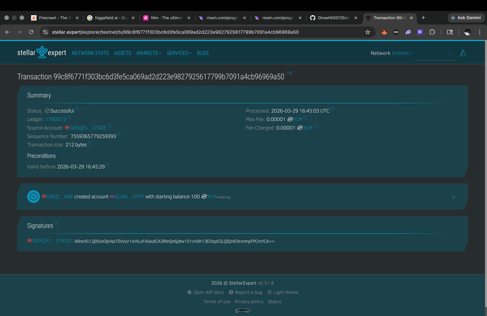

# StellrFlow Telegram Bot — Stellar Integration

Telegram bot + REST API backend for the StellrFlow hackathon project. Handles wallet management, XLM payments, fiat on/off ramp (anchor), recurring payments (AutoPay), and multi-signature transactions — all on Stellar testnet.

## Screenshots

| Wallet Connected | Balance Display |
|:---:|:---:|
|  |  |

| Sending Transaction | Transaction Result |
|:---:|:---:|
|  |  |

## Architecture

```
telegram-bot.ts          ← Telegram commands + Express API
    ├── anchor/
    │   ├── mockAnchor.ts      ← Simulated SEP-24 anchor (rates, delays)
    │   ├── stellarService.ts  ← Stellar SDK wrapper (balance, send, fund)
    │   ├── onramp.ts          ← Fiat → XLM deposit lifecycle
    │   ├── offramp.ts         ← XLM → fiat withdrawal lifecycle
    │   ├── anchorService.ts   ← Orchestration re-exports
    │   └── index.ts           ← Barrel export
    ├── sdk-chatbot.ts         ← AI chatbot (OpenAI)
    └── interval-parser.ts     ← Cron interval utilities
```

## Setup

### 1. Create Telegram Bot

1. Message [@BotFather](https://t.me/BotFather) on Telegram
2. Send `/newbot` and follow the prompts
3. Copy the bot token

### 2. Configure Environment

```bash
cd bots/telegram-stellar
cp .env.example .env
```

Edit `.env` and set your values:

| Variable | Required | Description |
|----------|----------|-------------|
| `TELEGRAM_BOT_TOKEN` | ✅ | Token from @BotFather |
| `PORT` | | Server port (default `3003`) |
| `STELLAR_NETWORK` | | `testnet` or `mainnet` (default `testnet`) |
| `HORIZON_URL` | | Override Horizon URL |
| `STELLAR_SECRET_KEY` | | Bot-funded payments key |
| `OPENAI_API_KEY` | | AI chatbot (optional) |

### 3. Install & Run

```bash
npm install
npm run build
npm start
```

Or for development:

```bash
npm run dev
```

### 4. Get Chat ID

1. Start a chat with your bot on Telegram
2. Send `/register`
3. Bot replies with your chat ID

## Telegram Commands

### General
| Command | Description |
|---------|-------------|
| `/start` | Welcome message |
| `/register` | Get your chat ID |
| `/help` | List all commands |
| `/status` | Session & feature status |

### Wallet
| Command | Description |
|---------|-------------|
| `/createwallet` | Create a Stellar testnet wallet |
| `/mywallet` | Show connected wallet info |
| `/mybalance` | Check XLM balance |
| `/fundwallet` | Fund wallet via Friendbot (testnet) |
| `/disconnect` | Disconnect wallet |

### Payments
| Command | Description |
|---------|-------------|
| `/send <address> <amount>` | Send XLM to an address |
| `/balance <address>` | Check any address balance |

### Anchor — On/Off Ramp
| Command | Description |
|---------|-------------|
| `/addfunds <amount> [currency]` | Deposit fiat → XLM (default USD) |
| `/withdraw <amount> [currency]` | Withdraw XLM → fiat (default USD) |
| `/rates [currency]` | View exchange rates |
| `/txhistory` | View transaction history |
| `/depositstatus <id>` | Check deposit status |
| `/withdrawstatus <id>` | Check withdrawal status |

**Supported currencies:** USD, EUR, INR, GBP

## REST API

### Telegram
| Method | Endpoint | Description |
|--------|----------|-------------|
| `POST` | `/api/telegram/send` | Send message `{ chatId, message }` |
| `GET` | `/api/telegram/health` | Health check |

### Session
| Method | Endpoint | Description |
|--------|----------|-------------|
| `POST` | `/api/session/register` | Register session |
| `GET` | `/api/session/:chatId` | Get session |
| `DELETE` | `/api/session/:chatId` | Delete session |

### Wallet (Telegram)
| Method | Endpoint | Description |
|--------|----------|-------------|
| `POST` | `/api/wallet/create` | Create wallet `{ chatId }` |
| `GET` | `/api/wallet/:chatId` | Get wallet info |
| `GET` | `/api/wallet/:chatId/balance` | Get balance |
| `POST` | `/api/wallet/:chatId/fund` | Fund via Friendbot |
| `POST` | `/api/wallet/:chatId/send` | Send XLM `{ destination, amount }` |

### Wallet (Freighter)
| Method | Endpoint | Description |
|--------|----------|-------------|
| `POST` | `/api/freighter/connect` | Connect Freighter `{ chatId, publicKey }` |
| `GET` | `/api/freighter/:chatId` | Get Freighter wallet |
| `GET` | `/api/freighter/:chatId/balance` | Get balance |
| `DELETE` | `/api/freighter/:chatId` | Disconnect |

### Transactions
| Method | Endpoint | Description |
|--------|----------|-------------|
| `POST` | `/api/transaction/build` | Build unsigned XDR |
| `POST` | `/api/transaction/submit` | Submit signed XDR |
| `GET` | `/api/stellar/balance/:address` | Get balance by address |

### Anchor (On/Off Ramp)
| Method | Endpoint | Description |
|--------|----------|-------------|
| `POST` | `/api/anchor/deposit` | Deposit fiat → XLM `{ chatId, amount, currency }` |
| `POST` | `/api/anchor/withdraw` | Withdraw XLM → fiat `{ chatId, xlmAmount, currency }` |
| `GET` | `/api/anchor/rates` | Get exchange rates |
| `GET` | `/api/anchor/history/:chatId` | Transaction history |

### AutoPay (Recurring Payments)
| Method | Endpoint | Description |
|--------|----------|-------------|
| `POST` | `/api/autopay/create` | Create schedule `{ chatId, destination, amount, interval }` |
| `GET` | `/api/autopay/:chatId` | List schedules |
| `DELETE` | `/api/autopay/:scheduleId` | Cancel schedule |

### Multisig
| Method | Endpoint | Description |
|--------|----------|-------------|
| `POST` | `/api/multisig/create` | Create multisig tx `{ chatId, signers, threshold, ... }` |
| `GET` | `/api/multisig/:chatId` | List multisig txs |

## Anchor Module

The anchor system simulates [SEP-24](https://stellar.org/protocol/sep-24) interactive deposits/withdrawals for hackathon demo purposes.

**Demo exchange rates:**
| Currency | 1 unit → XLM | 1 XLM → fiat |
|----------|-------------|-------------|
| USD | 10 XLM | $0.10 |
| EUR | 11 XLM | €0.09 |
| INR | 0.12 XLM | ₹8.33 |
| GBP | 12.5 XLM | £0.08 |

**Deposit flow:** Fiat amount → mock anchor (2.5s delay) → Friendbot credits XLM → wallet funded

**Withdrawal flow:** Validate balance (keeps 1.5 XLM reserve) → send XLM on-chain → mock anchor (3s delay) → fiat payout simulated

## Tech Stack

- **Runtime:** Node.js + TypeScript (ESM)
- **Stellar:** `@stellar/stellar-sdk` v14 — Horizon, testnet
- **Telegram:** `node-telegram-bot-api` (polling mode)
- **API:** Express + CORS on port 3003
- **AI:** OpenAI SDK (optional chatbot)

## Integration with Frontend

Set the API base URL in the StellrFlow frontend to `http://localhost:3003` when using Stellar workflow nodes.

## References

- [Stellar Developer Docs](https://developers.stellar.org/docs)
- [@stellar/stellar-sdk](https://stellar.github.io/js-stellar-sdk/)
- [SEP-24 Spec](https://stellar.org/protocol/sep-24)
- [Telegram Bot API](https://core.telegram.org/bots/api)
